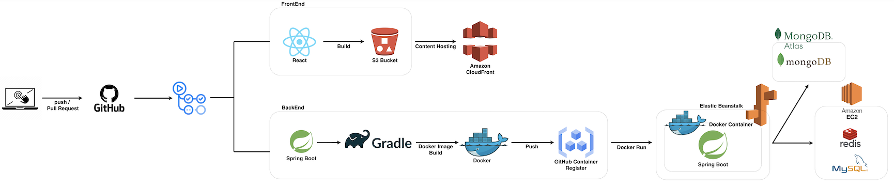

# ✈️ 여행한DAY - The Travel Day ✈️


# 🔎 서비스 소개 Introduction

---
[**여행한DAY**](https://www.thetravelday.co.kr/)는 일행과 함께 일정을 계획하고 
<br>
글로벌 운항 시스템(GDS)에서 추출한 **항공 특가 정보**를 확인 할 수 있는 
<br>
**여행 계획 공유 플랫폼**입니다.
* [React 프론트엔드 레포지토리](https://github.com/100-hours-a-week/5-CKNS-final-front)
* [Disquiet 프로덕트 소개](https://disquiet.io/product/%EC%97%AC%ED%96%89%ED%95%9Cday)

# 👨‍💻 팀원 소개 

---
| <center>이현도(PM)</center>              | <center>전연주</center>                               | <center>김준호</center>                | <center>김소민</center>                                    |
|----------------------------------|----------------------------------------------|------------------------------|---------------------------------------------------------|
| <center>Frontend, Infra</center>      | <center>Frontend, Design</center>               | <center>Backend</center>      | <center>Backend</center>                                |
| <center>[@HidenLee](https://github.com/HidenLee)</center> | <center>[@collie-jun](https://github.com/collie-jun)</center> | <center>[@sean](https://github.com/grulla79)</center> | <center>[@ss0ming](https://github.com/ss0ming)</center> |

# 📅 프로젝트 일정

---
> 2024.07.21 ~ 2024.10.06

| 스프린트  | 기간                          | 설명                                                                               |
|---------|-----------------------------|----------------------------------------------------------------------------------|
| 1       | `2024/07/22` → `2024/08/11` | 프로젝트 기획, <br/>기술 선정, <br/>기능, API 설계, <br/>ERD 설계, <br/>개발 환경 세팅, <br/>그라운드 룰 설정 |
| 2       | `2024/08/12` → `2024/08/25` | MVP 개발, <br/> 내부 QA<br/>1차 배포 및 홍보                                               |
| 3       | `2024/08/26` → `2024/09/08` | 실 서비스 운영,<br/> 사용자 피드백 반영, <br/> 부가 기능 구현                                        |
| 4       | `2024/09/09` → `2024/09/20` | 2차 배포 및 운영                                                                       |
| 5       | `2024/09/23` → `2024/10/06` | 개발 마무리, <br/> 구조 리팩토링, <br/>개발 문서 정리                                             |


## 🕹 주요 기능️ Main Feature

---


메인 화면| 여행방 생성                                                                                                               | 일정 추가                                                                                                                |일정 순서 변경
--- |----------------------------------------------------------------------------------------------------------------------|----------------------------------------------------------------------------------------------------------------------| --- |
 |  |  | 

## 🔧 기술 스택 Stack

---

[//]: # (### Back-End)

[//]: # (```markdown)

[//]: # (Language : Java 17)

[//]: # (Framework : SpringBoot 3.3.2)

[//]: # (```)

[//]: # ()
[//]: # (### Front-End)

[//]: # (```markdown)

[//]: # (Language: JavaScript)

[//]: # (Framework: React 18.3.1)

[//]: # (Styling: Styled-components)

[//]: # (State Management: Zustand 4.5.4)

[//]: # (Library:  )

[//]: # (- Axios 1.7.4 )

[//]: # (- STOMP 7.0.0)

[//]: # (- SockJS-client 1.6.1)

[//]: # (- Firebase 10.13.1)

[//]: # (```)

### Front-End


### Back-End


### Database


###  Push Events & Chatting


### AWS Server


### CI/CD & Infra Tools


### Storage


### Collaboration Tools


### Issue & Configuration Management


### Monitoring


## 🗺 서비스 아키텍처 Architecture

### system flow
---


---
### user flow
---


---
## 📝 데이터베이스 설계 ERD

---


## ✅ 개발 문서 

- Notion : [팀 노션](https://goormkdx.notion.site/4-DAY-7f984f2c8d2949c6857ed19164cd2cf5?pvs=4)
